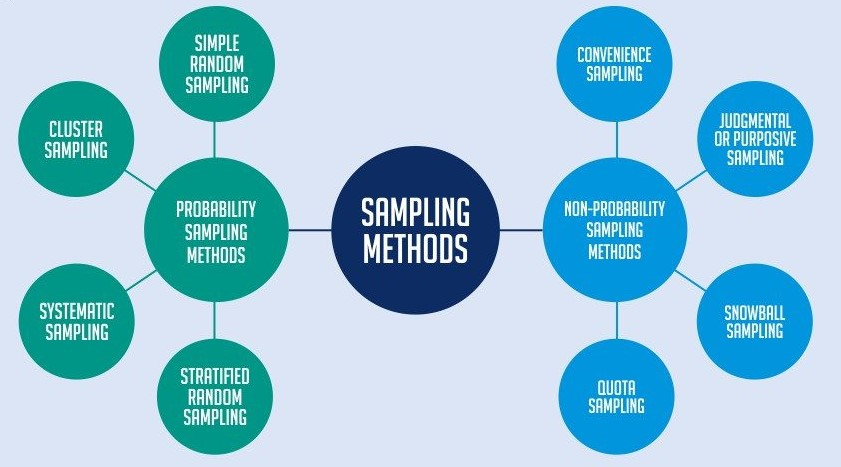
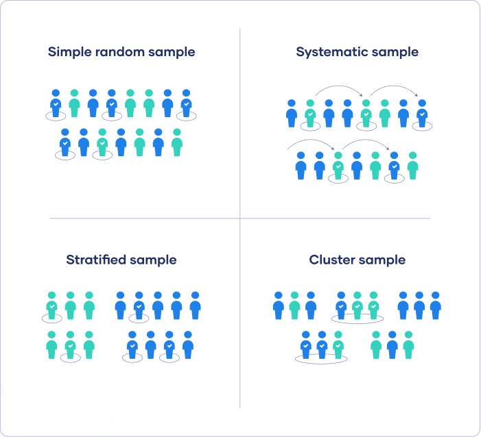
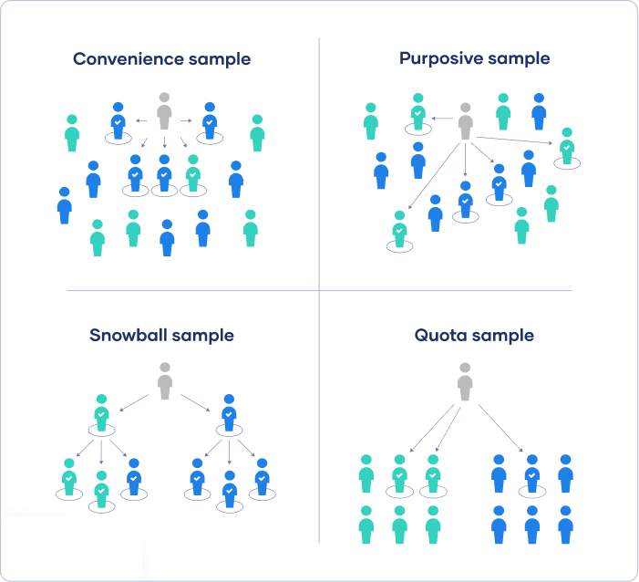

 > # **STATISTICS**
 Facts or data, either numerical or non-numerical, organized and summarized so as to provide useful and  accesible information about a particular subject.
 Statistics are classified into two types,
 > ### **Descriptive Statistics**
 It consists of methods for organizing and summarizing information.
 > ### **Inferential Statistics**
 It consists of methods for drawing and measuring the reliability of conclusions about a **population** based on infomation obtained from a **sample** of **population**.
 > ##### **Population**
 The collection of all individuals or items under consideration in a statistical study.
 > ##### **Sample**
 The part of population from which information is obtained.

 
 > # **SAMPLING**
 A **sample** is obtained by the process of **sampling**.
 # 
 Sampling methods are classified into two types,
 1. **Probability Sampling Methods**
 2. **Non-Probability Sampling Methods**
 

 
 > ## **Probability Sampling Methods**
 
 Probability Sampling methods are further classified into four types,
 1. **Simple random sampling**
 2. **Systematic random sampling**
 3. **Cluster sampling**
 4. **Stratified random sampling**

 
 > ## **Non-Probability Sampling Methods**
 # 
 Non-Probability Sampling methods are further classified into four types,
 1. **Convinience sampling**
 2. **Purposive sampling**
 3. **Snowball sampling**
 4. **Quota sampling**

